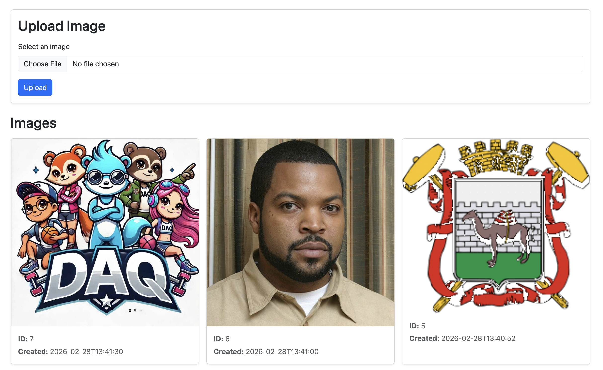
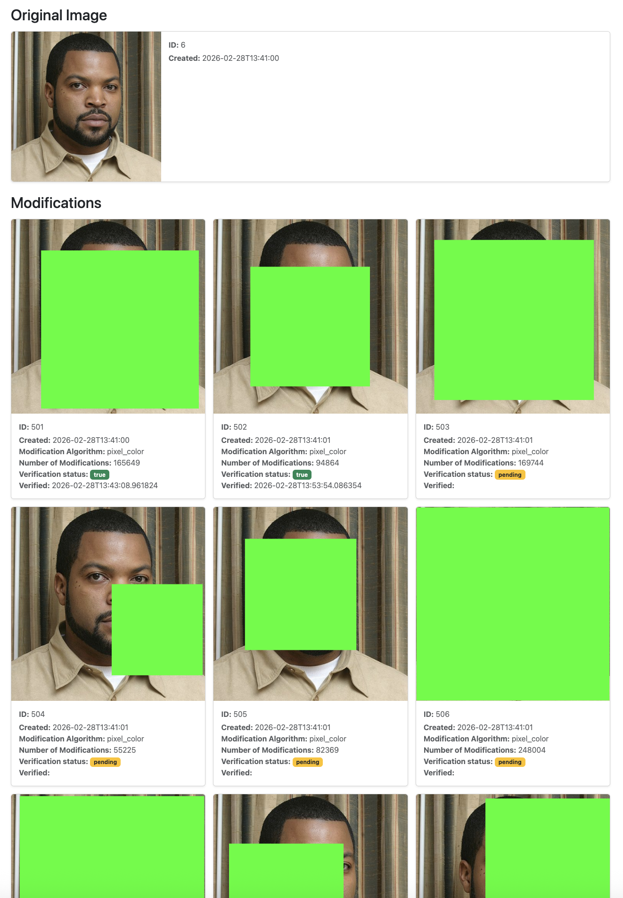

# python-image-modifications

Generate 100 variants for each uploaded image by applying randomized per‑pixel changes (from 100 modifications up to the image’s maximum pixel number).
A background task then verifies whether the original image is reversible using stored modification metadata from the database.


### Stack

- Backend: Python (FastAPI)
- Frontend: Alpine.js + Bootstrap
- Containerization: Docker Compose

### How to run

Build and start all services:
```
docker compose up --build
```

API docs available at: http://localhost:8000/docs  
Frontend available at: http://localhost:8000/frontend

### UI

Index page:


Details page:

